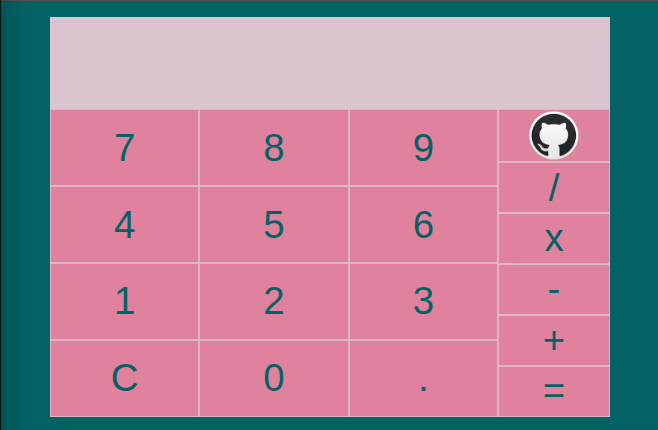
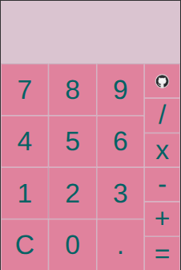

# basic_calculator

This project is a basic calculator app built as part of The Odin Project’s Foundations curriculum.

## Features
- Perform basic arithmetic operations: addition, subtraction, multiplication, and division  
- Clear and reset functionality  
- Decimal input support  
- Separate display areas for the current expression and the preview result  
- Input validation to prevent invalid numbers (e.g., multiple decimals in a single number)  
- Mobile-first responsive design for smooth use on phones and tablets  

## Tech Stack
- JavaScript (vanilla)  
- HTML  
- CSS  

## Extra Features
- Expression history display for clarity  
- Input length management to prevent overflow in the display  

## Preview

  
  

## Future Improvements
- Support for negative numbers (e.g., `22 ÷ -1`)  
- Parentheses for grouped expressions  
- Keyboard input support  
- Scientific operations (square root, exponents, etc.)  
- Operator highlighting to indicate the current operation  

## Acknowledgements
- Built as part of The Odin Project’s [Foundations course](https://www.theodinproject.com/lessons/foundations-calculator)  
